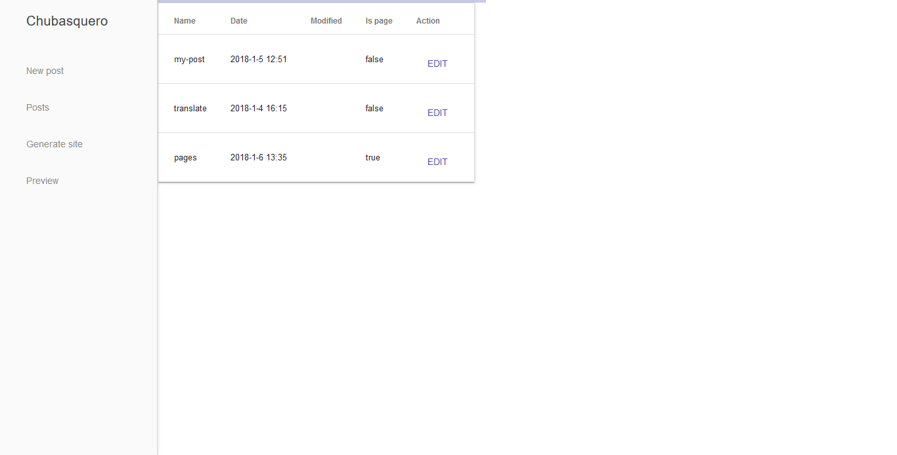

Chubasquero
###########

Chubasquero is a CMS built on top of Pelican.

    

Why
===

When working with static blog/site generators like Pelican it is common (at least for me)
to have an editor to create and edit posts, a terminal to generate the site 
and a browser to preview the site changes.

Features
========

* Create posts.
* Edit posts.
* Edit post metadata such as category or tags.
* Convert a post to page and viceversa.
* Add translations to posts/pages.
* Generate the site.
* Preview the site.

How to use it
=============

Chubasquero is a CLI program (you need a terminal). Go to any pelican project,
with a *pelicanconf.py* in its root, then just type in the terminal

.. code::

    > chubasquero

Wait a few seconds. Chubasquero will open your default browser or a tab in your
default browser with the webapp ready to be used.

To close the application press Ctrl+C on the terminal where chubasquero is running.

Made with
=========

* Flask
* Vuejs
* Material Design Lite

License
=======

.. image:: https://www.gnu.org/graphics/agplv3-155x51.png
    :alt: AGPLv3
